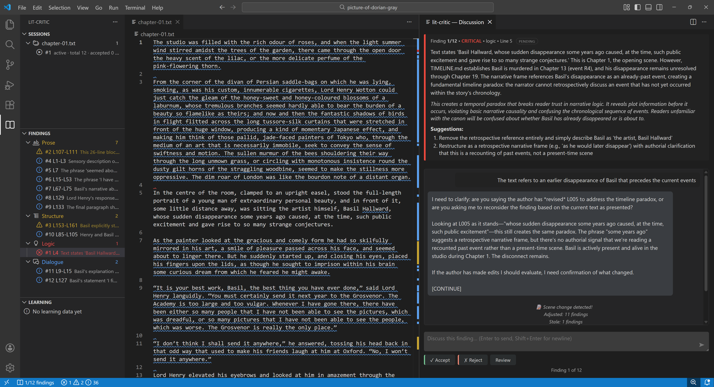

# lit-critic

**A multi-lens editorial review system for fiction manuscripts.**

lit-critic (short for Literary Critic) reads your novel scenes and provides detailed feedback through six analytical "lenses": Prose, Structure, Logic, Clarity, Continuity, and Dialogue. The tool doesn't generate your content or impose external standards; it checks your work against **your own rules** as defined in your project's index files.

<p align="center">
  
</p>

---

## Table of Contents

- [How It Works](#how-it-works)
- [For Authors](#-for-novel-authors)
  - [What You Get](#what-you-get)
  - [Quick Start](#quick-start)
  - [Three Interfaces](#three-interfaces)
  - [Cost Estimate](#cost-estimate)
  - [Multilingual Support](#multilingual-support)
- [For Developers](#-for-developers)
  - [Architecture at a Glance](#architecture-at-a-glance)
  - [Developer Quick Start](#developer-quick-start)
  - [Key Technical Features](#key-technical-features)
- [Requirements](#requirements)
- [Support](#support)
- [Roadmap](#roadmap)
- [Beyond Fiction](#beyond-fiction)
- [License](#license)

---

## How It Works

1. **Loads** your index files (CANON, CAST, GLOSSARY, STYLE, THREADS, TIMELINE) and scene
2. **Runs 6 lenses in parallel**: Prose, Structure, Logic, Clarity, Continuity, Dialogue
3. **Coordinates** results: deduplicates, prioritizes, detects conflicts
4. **Presents** findings with line-number locations
5. **Discusses** findings with you — the AI can revise, withdraw, or defend based on your input
6. **Learns** your preferences for future sessions
7. **Auto-saves everything** — close anytime, resume anywhere

---

## 📚 For Novel Authors

You're writing a novel and want AI-powered editorial feedback that respects your voice and world-building.

### What You Get

lit-critic is an **editorial assistant, not a content generator**. It will never write prose for you, rewrite your sentences, or impose external standards. It reads your scenes, checks them against rules *you* define in your index files, and presents findings for you to accept, reject, or discuss. When it suggests specific wording (rarely), it's minimal — a couple of example words to illustrate a concept, never a rewritten paragraph. Your novel, your voice.

- ✅ **Six editorial lenses** — Prose, Structure, Logic, Clarity, Continuity, Dialogue
- ✅ **Cross-scene analysis (consecutive scenes)** — analyze scene sets in one session for arc-level structure, logic, and continuity checks
- ✅ **Batch-style scene-set workflow** — run one review session across multiple consecutive scene files instead of one file at a time
- ✅ **Three interfaces** — CLI, Web UI, VS Code Extension (all use the same workflow)
- ✅ **Auto-reveal in VS Code** — when a `CANON.md` project opens and extension auto-start runs, the lit-critic activity view is shown automatically
- ✅ **Quick model switching in VS Code** — use the Sessions view toolbar button (**Change Analysis Model**) next to Analyze/Refresh before starting a new session
- ✅ **Auto-refreshing model registry** — provider model catalogs can be auto-discovered (with cache + TTL), so new models can appear in `/api/config` without code edits
- ✅ **Status-first Findings tree in VS Code** — pending findings are visually prioritized with severity tokens for quick triage
- ✅ **Smart lens presets** — auto-selects based on scene count; manual override available (balanced, prose-first, story-logic, clarity-pass)
- ✅ **Interactive discussion** — debate findings; the AI can revise or withdraw
- ✅ **Resizable VS Code discussion input** — drag the panel textarea handle to expand/shrink longer prompts comfortably
- ✅ **Discussion context snapshots on re-review** — when a scene edit changes a finding, prior discussion remains visible as archived context and a new discussion block starts for the updated finding
- ✅ **Learning system** — adapts to your style over time
- ✅ **Auto-save & resume** — every decision is instantly saved; close anytime, with moved-scene recovery prompts when paths change (including per-scene relinking for multi-scene sessions)
- ✅ **Session management** — view history, inspect findings, clean up old reviews
- ✅ **Slow-operation feedback in VS Code** — long-running actions (session load/refresh/resume) show progressive busy indicators and are timing-logged for diagnostics
- ✅ **Scene change detection** — edit mid-review; line numbers adjust automatically
- ✅ **Your rules, your voice** — validates against CANON, CAST, GLOSSARY, STYLE, THREADS, TIMELINE

### Quick Start

**1. Install**

```bash
git clone https://github.com/alexisargyris/lit-critic.git
cd lit-critic
pip install -r requirements.txt
```

**2. Set your API key** (at least one)

```bash
# macOS / Linux
export ANTHROPIC_API_KEY="your-key-here"
export OPENAI_API_KEY="your-key-here"

# Windows
setx ANTHROPIC_API_KEY "your-key-here"
setx OPENAI_API_KEY "your-key-here"
```

**3. Set up your novel project**

```
my-novel/
├── CANON.md              # World rules and invariants
├── CAST.md               # Character facts and relationships
├── GLOSSARY.md           # Controlled vocabulary
├── STYLE.md              # Prose rules
├── THREADS.md            # Narrative promises
├── TIMELINE.md           # Scene sequence
└── text/
    └── 01.01.01_scene.txt   # Scene files with @@META headers
```

Use the **[templates](docs/user-guide/templates/)** to get started quickly.

**4. Run your first review**

```bash
python lit-critic.py analyze --scene ~/my-novel/text/01.01.01_scene.txt --project ~/my-novel/
```

For multi-scene/cross-scene reviews, use the Web UI or VS Code extension selection flow.

All your work is auto-saved to a `.lit-critic.db` file in your project folder — you never need to manually save.

See the **[Getting Started Guide](docs/user-guide/getting-started.md)** for a detailed walkthrough.

### Three Interfaces

| Interface | Best For | How to Launch |
|-----------|----------|---------------|
| **CLI** | Keyboard-driven workflow (single-scene) | `python lit-critic.py analyze --scene scene.txt --project ~/novel/` |
| **Web UI** | Visual interface | `python lit-critic-web.py` → http://localhost:8000 |
| **VS Code Extension** | Native editor integration (multi-scene selection UI, also used for single-scene runs) | `Ctrl+Shift+L` or Command Palette → "Analyze Current Scene" |

All three run through the same Platform-managed workflow and project database (`.lit-critic.db`) — start a review in one, resume in another, even after moving projects across machines (you can relink moved scene paths at resume time).

See **[Using the Tool](docs/user-guide/using-the-tool.md)** for details on each interface.

### Cost Estimate

Examples based on Anthropic models.

| Model | Cost per Scene | Notes |
|-------|---------------|-------|
| **Sonnet** | ~$0.10–0.15 | Good balance of quality and cost |
| **Opus** | ~$0.50–0.75 | Deepest analysis |
| **Haiku** | ~$0.02–0.05 | Fastest |

### Multilingual Support

Your novel can be in **any language** supported by your chosen AI model (100+ languages). lit-critic analyzes your prose natively and provides feedback in English ensuring consistent, high-quality editorial vocabulary regardless of your novel's language. Your index files can also be in your novel's language.

### 📖 Full User Guide

- **[Getting Started](docs/user-guide/getting-started.md)** — Setup walkthrough
- **[Scene Format](docs/user-guide/scene-format.md)** — @@META header documentation
- **[Index Files](docs/user-guide/index-files.md)** — CANON, CAST, GLOSSARY, STYLE, THREADS, TIMELINE
- **[Using the Tool](docs/user-guide/using-the-tool.md)** — CLI, Web UI, VS Code
- **[Working with Findings](docs/user-guide/working-with-findings.md)** — Accept, reject, discuss
- **[Learning System](docs/user-guide/learning-system.md)** — Adaptation to your style
- **[Templates](docs/user-guide/templates/)** — Starter files for scenes and index files

---

## 🔧 For Developers

You want to integrate lit-critic into your tools or understand its architecture.

### Architecture at a Glance

```
lit-critic/
├── core/                   # Stateless reasoning service + /v1 contracts
├── lit_platform/           # Workflow, persistence, orchestration owner
├── contracts/              # Versioned request/response contracts
├── cli/                    # CLI interface
├── web/                    # FastAPI web/API surface over Platform
├── vscode-extension/       # VS Code extension (TypeScript)
├── tests/                  # Test suites (Python + TypeScript)
└── docs/
    ├── user-guide/         # Non-technical documentation
    └── technical/          # Developer documentation
```

The system is split into:

- **Core (`core/`)** — stateless reasoning endpoints (`/v1/*`)
- **Platform (`lit_platform/`)** — session lifecycle, persistence, orchestration, retries, and state transitions
- **Clients (CLI/Web/VS Code)** — thin interaction layers over Platform APIs/services

Session state, findings, and learning data are persisted in a per-project **SQLite database** (`.lit-critic.db`) with WAL mode, foreign keys, and schema versioning.

See the **[Architecture Guide](docs/technical/architecture.md)** for the full system design and data flow diagram.

### Developer Quick Start

```bash
# Clone and install
git clone https://github.com/alexisargyris/lit-critic.git
cd lit-critic

# Install both Python + TypeScript dependencies
npm run install

# (Equivalent Python-only install)
pip install -r requirements.txt

# Run all tests (Python + TypeScript)
npm test

# Run SemVer/component compatibility checks
npm run release:check

# (Optional) run only the release-intent guard
npm run check:release-intent

# (Optional) install local git hooks for release checks on push
npm run hooks:install

# Python tests only (with coverage)
pytest --cov=core --cov=lit_platform --cov=cli --cov=web --cov=contracts

# TypeScript tests only
npm run test:ts

# Start the web UI with auto-reload
python lit-critic-web.py --reload

# VS Code extension development
cd vscode-extension && code .    # Then press F5
```

See the **[Installation Guide](docs/technical/installation.md)** for full developer setup.

### Key Technical Features

- **Stateless Core** — Contract-first reasoning endpoints (`/v1/analyze`, `/v1/discuss`, `/v1/re-evaluate-finding`)
- **Platform-owned workflow** — Session lifecycle, persistence, scene/index loading, and Core transport are centralized in `lit_platform/`
- **SQLite persistence** — Auto-save with WAL mode, foreign keys, schema versioning; session/finding/learning stores with full CRUD
- **Streaming responses** — Token-by-token discussion via SSE
- **Structured output** — LLM tool use for reliable parsing
- **Line-number + source-scene tracking** — Findings include precise local line ranges and source `scene_path` for multi-scene navigation
- **Consecutive multi-scene analysis** — Scene sets are analyzed in one session with cross-scene continuity/logic reasoning
- **Interoperable sessions** — Same project database works across CLI, Web UI, and VS Code
- **Management API** — Platform endpoints for session history, learning data, and cleanup
- **Dynamic model registry** — curated baseline + optional provider auto-discovery + local cache fallback for resilient model availability
- **SemVer governance (no-CI)** — Component versions + compatibility matrix with local validator and pre-push hook support
- **Release-intent guard** — Detects component changes without matching `versioning/compatibility.json` update (including pre-push ref-aware checks)
- **Comprehensive tests** — Python (pytest) and TypeScript (mocha)
- **Real novel test corpus** — Public-domain text (*The Picture of Dorian Gray*) with index files for integration testing against real prose

### 📖 Full Technical Docs

- **[Architecture Guide](docs/technical/architecture.md)** — System design with visual diagram
- **[API Reference](docs/technical/api-reference.md)** — Complete REST API documentation
- **[Installation Guide](docs/technical/installation.md)** — Developer setup instructions
- **[Testing Guide](docs/technical/testing.md)** — Running and writing tests
- **[Versioning & Compatibility](docs/technical/versioning.md)** — SemVer policy, compatibility matrix, and local enforcement
- **[Release Checklist](docs/technical/release-checklist.md)** — Step-by-step no-CI release workflow

---

## Requirements

- **Python 3.10+**
- **At least one API key:**
  - `ANTHROPIC_API_KEY` for Claude models
  - `OPENAI_API_KEY` for GPT models
  - If analysis and discussion models use different providers, configure both keys.
- **Node.js 16+** (for VS Code extension only)

Optional model-registry environment variables (advanced):
- `LIT_CRITIC_MODEL_DISCOVERY_ENABLED` (`1`/`0`) — enable or disable provider auto-discovery
- `LIT_CRITIC_MODEL_DISCOVERY_TTL_SECONDS` — refresh interval for provider discovery
- `LIT_CRITIC_MODEL_DISCOVERY_TIMEOUT_SECONDS` — provider API timeout for discovery calls
- `LIT_CRITIC_MODEL_CACHE_PATH` — override cache file path for discovered models

---

## Support

> This is a personal tool that I maintain for my own novel-writing workflow. I'm sharing it publicly in case it's useful to others.

It started as a weekend exercise to test claude-opus-4-6 functionality. Later, all Anthropic and OpenAI models contributed code, tests or documentation. 

I intend to continue working on it for my personal use but please note:
- **No support provided** — Use at your own risk
- **Not accepting contributions** — I implement features as I need them
- **Issues/PRs may be ignored** — I fix what affects me
- **Fork and adapt** — Feel free to fork and adapt it to your needs

---

## Roadmap

This roadmap reflects **personal priorities** based on my novel-writing needs. Features will be implemented as I need them for my own work.

### Potential Future Features
- Configurable lenses (enable/disable per session)
- Custom lens definitions
- Confidence tracking for learned preferences
- Git integration (auto-commit LEARNING.md, tag reviewed scenes)
- MCP server for integration with AI development tools

No timeline or guarantees.

---

## Beyond Fiction

If there is something generally useful in this repository, it is probably not the code itself but the **cooperative model** between human author and LLM that underpins it.

lit-critic is built around a deliberate division of labour:

- **The human**: creativity, intent, taste, and final judgement.
- **The LLM**: adherence to rules, cross-referencing of large context, and structured analysis.

Neither party does the other's job. The author never asks the LLM to write prose; the LLM never overrides the author's creative decisions. Instead, the author defines the rules (index files) and the LLM enforces them, presenting findings for the author to accept, reject, or debate. The result is a feedback loop where each side contributes what it does best.

This pattern is not specific to fiction. The same principle — *human sets the rules and owns the creative/strategic decisions; LLM audits, cross-checks, and surfaces issues* — could apply to other domains: technical writing, legal document review, or even poetry. (A "lyric-critic" that checks your sonnets against your own declared meter and rhyme scheme? Mostly a joke — but only mostly.)

---

## License

MIT License — see the [LICENSE](LICENSE) file for details.

Copyright (c) 2026 Alexis Argyris
