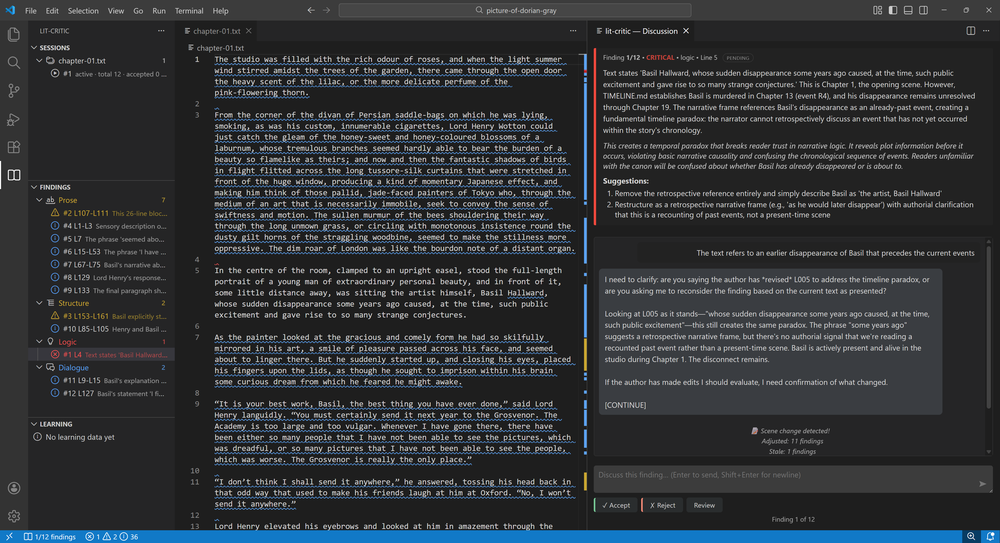

# lit-critic

**A multi-lens editorial review system for fiction manuscripts.**

lit-critic (short for Literary Critic) reads your novel scenes and provides detailed feedback through seven analytical "lenses": Prose, Structure, Logic, Clarity, Continuity, Dialogue, and Horizon. The tool doesn't generate your content or impose external standards; it checks your work against **your own rules** — CANON.md and STYLE.md (which you write) plus knowledge extracted automatically from your prose. It also guards against its own sycophantic tendencies — resisting premature concession when you disagree.

<p align="center">
  
</p>

---

## Table of Contents

- [How It Works](#how-it-works)
- [For Authors](#-for-novel-authors)
  - [What You Get](#what-you-get)
  - [Quick Start](#quick-start)
  - [Three Interfaces](#three-interfaces)
  - [Cost Estimate](#cost-estimate)
  - [Multilingual Support](#multilingual-support)
- [For Developers](#-for-developers)
  - [Architecture at a Glance](#architecture-at-a-glance)
  - [Developer Quick Start](#developer-quick-start)
  - [Key Technical Features](#key-technical-features)
- [Requirements](#requirements)
- [Support](#support)
- [Roadmap](#roadmap)
- [Beyond Fiction](#beyond-fiction)
- [License](#license)

---

## How It Works

1. **Loads** CANON.md and STYLE.md from files, loads auto-extracted knowledge (Cast, Glossary, Threads, Timeline) from the project database, and scene
2. **Runs 7 lenses in parallel**: Prose, Structure, Logic, Clarity, Continuity, Dialogue, and Horizon
3. **Coordinates** results: deduplicates, prioritizes, detects conflicts
4. **Presents** findings with line-number locations
5. **Discusses** findings with you. The AI can revise, withdraw, or defend based on your input
6. **Learns** your preferences for future sessions
7. **Auto-saves everything**: close anytime, resume anywhere
8. **Summarizes** what may have been missed — a brief meta-observation after all findings are resolved

---

## 📚 For Novel Authors

You're writing a novel and want AI-powered editorial feedback that respects your voice and world-building.

### What You Get

lit-critic is an **editorial assistant, not a content generator**. It will never write prose for you, rewrite your sentences, or impose external standards. It reads your scenes, checks them against CANON.md and STYLE.md (which you write) plus knowledge extracted automatically from your prose, and presents findings for you to accept, reject, or discuss. When it suggests specific wording (rarely), it's minimal, a couple of example words to illustrate a concept, never a rewritten paragraph. Your novel, your voice.

- ✅ **Seven editorial lenses**: Prose, Structure, Logic, Clarity, Continuity, Dialogue, and Horizon
- ✅ **Anti-sycophancy editorial independence**: the critic resists premature concession; distinguishes *rejection* (author prerogative) from *concession* (critic error); uses steelman check and first-turn patience before resolving — see **[Sycophancy & Editorial Independence](docs/user-guide/sycophancy.md)**
- ✅ **Session-end disconfirming summary**: after all findings are resolved, the critic delivers a brief meta-observation — what patterns the rejections suggest, and what every lens may have missed
- ✅ **Cross-scene analysis (consecutive scenes)**: analyze scene sets in one session for arc-level structure, logic, and continuity checks
- ✅ **Batch-style scene-set workflow**: run one review session across multiple consecutive scene files instead of one file at a time
- ✅ **Three interfaces**: CLI, Web UI, VS Code Extension (all use the same workflow)
- ✅ **Auto-reveal in VS Code**: when a `CANON.md` project opens and extension auto-start runs, the lit-critic activity view is shown automatically
- ✅ **Quick mode switching in VS Code**: use the Sessions view toolbar button (**Change Analysis Mode**) next to Analyze/Refresh before starting a new session
- ✅ **Auto-refreshing model registry**: provider model catalogs can be auto-discovered (with cache + TTL), so new models can appear in `/api/config` without code edits
- ✅ **Status-first Findings tree in VS Code**: pending findings are visually prioritized with severity tokens for quick triage
- ✅ **Mode-first analysis flow**: choose `quick` or `deep`; model slots (`frontier`, `quick`, `deep`) resolve automatically from settings
- ✅ **Interactive discussion**: debate findings; the AI can revise or withdraw
- ✅ **Resizable VS Code discussion input**: drag the panel textarea handle to expand/shrink longer prompts comfortably
- ✅ **Discussion context snapshots on re-review**: when a scene edit changes a finding, prior discussion remains visible as archived context and a new discussion block starts for the updated finding
- ✅ **Learning system**: adapts to your style over time
- ✅ **Safer automated knowledge extraction + reconciliation**: knowledge extraction uses CANON.md as read-only reference context to reduce duplicate proposals and chronology contradictions; duplicate detected entries are reconciled (new data wins, provenance preserved)
- ✅ **Auto-save & resume**: every decision is instantly saved; close anytime, with moved-scene recovery prompts when paths change (including per-scene relinking for multi-scene sessions)
- ✅ **Session management**: view history, inspect findings, clean up old reviews
- ✅ **Slow-operation feedback in VS Code**: long-running actions (session load/refresh/resume) show progressive busy indicators and are timing-logged for diagnostics
- ✅ **Scene change detection**: edit mid-review; line numbers adjust automatically
- ✅ **Your rules, your voice**: validates against CANON.md, STYLE.md, and auto-extracted knowledge (Cast, Glossary, Threads, Timeline)

### Quick Start

**1. Install**

```bash
git clone https://github.com/alexisargyris/lit-critic.git
cd lit-critic
pip install -r requirements.txt
```

**2. Set your API key** (at least one)

```bash
# macOS / Linux
export ANTHROPIC_API_KEY="your-key-here"
export OPENAI_API_KEY="your-key-here"

# Windows
setx ANTHROPIC_API_KEY "your-key-here"
setx OPENAI_API_KEY "your-key-here"
```

**3. Set up your novel project**

```
my-novel/
├── CANON.md              # World rules and invariants (you write this)
├── STYLE.md              # Prose rules (you write this)
└── text/
    └── 01.01.01_scene.txt   # Scene files with @@META headers
```

Characters, terms, threads, and timeline entries are extracted automatically from your prose — no hand-maintained index files needed. See the **[Knowledge Management Guide](docs/user-guide/index-files.md)** for details.

Use the **[templates](docs/user-guide/templates/)** to get started quickly.

**4. Run your first review**

```bash
python -m cli sessions start --mode quick --scene ~/my-novel/text/01.01.01_scene.txt --project ~/my-novel/
```

For multi-scene/cross-scene reviews, use the Web UI or VS Code extension selection flow.

All your work is auto-saved to a `.lit-critic.db` file in your project folder, you never need to manually save.

See the **[Getting Started Guide](docs/user-guide/getting-started.md)** for a detailed walkthrough.

### Three Interfaces

| Interface | Best For | How to Launch |
|-----------|----------|---------------|
| **CLI** | Keyboard-driven workflow (single-scene) | `python -m cli sessions start --mode quick --scene scene.txt --project ~/novel/` |
| **Web UI** | Visual interface | `python lit-critic-web.py` → http://localhost:8000 |
| **VS Code Extension** | Native editor integration (multi-scene selection UI, also used for single-scene runs) | `Ctrl+Shift+L` or Command Palette → "Analyze Current Scene" |

All three run through the same Platform-managed workflow and project database (`.lit-critic.db`). Start a review in one, resume in another, even after moving projects across machines (you can relink moved scene paths at resume time).

### Focus Areas (canonical across clients)

All clients align around the same four canonical buckets:

- **Knowledge**: refresh/review/export workflows
- **Scenes**: list/lock/unlock/rename workflows
- **Sessions**: start/resume/history workflows
- **Learning**: list/add/update/export/reset workflows

Compact cross-client mapping:

| Bucket | CLI | Web UI | VS Code |
|---|---|---|---|
| **Knowledge** | `knowledge refresh/review/export` | Knowledge refresh + review flows | Knowledge tree view + refresh/review commands |
| **Scenes** | `scenes list/lock/unlock/rename` | Scene list + lock/rename flows | Inputs tree view + scene management commands |
| **Sessions** | `sessions start/resume/list/show/delete` | Session start/resume/history flows | Analyze/resume/session tree workflows |
| **Learning** | `learning list/add/update/export/reset` | Learning list/export/reset flows | Learning tree + learning management commands |

Key distinction:
- **Sessions start (`--mode quick|deep`)** = full scene analysis workflow
- **Knowledge refresh** = validate scene chain + extract knowledge from changed scenes (incremental, hash-based)

Examples:

```bash
python -m cli sessions start --scene scene.txt --project ~/novel --mode quick
python -m cli knowledge refresh --project ~/novel
python -m cli knowledge review --project ~/novel
python -m cli scenes list --project ~/novel
```

### Release Notes: Focus Areas terminology alignment

- Standardized user-facing command vocabulary across CLI, Web UI, and VS Code around **Knowledge, Scenes, Sessions, and Learning**.
- CLI command structure is noun-first (`knowledge`, `scenes`, `sessions`, `learning`) with verb-style subcommands.
See **[Using the Tool](docs/user-guide/using-the-tool.md)** for details on each interface.

### Cost Estimate

Analysis cost is mode-first and slot-driven:

| Mode | Typical Cost Profile | What Runs |
|------|-----------------------|-----------|
| **Quick review** | Lower | 7-lens run with checker tasks on `quick` and critic tasks on `frontier` |
| **Deep review** | Higher | 7-lens run with checker tasks on `deep` and critic tasks on `frontier` |

For per-project hints, use `/api/config` (`mode_cost_hints`) and post-run `tier_cost_summary` in analyze responses.

### Multilingual Support

Your novel can be in **any language** supported by your chosen AI model (100+ languages). lit-critic analyzes your prose natively and provides feedback in English ensuring consistent, high-quality editorial vocabulary regardless of your novel's language. Your index files can also be in your novel's language.

### 📖 Full User Guide

- **[Getting Started](docs/user-guide/getting-started.md)**: Setup walkthrough
- **[Scene Format](docs/user-guide/scene-format.md)**: @@META header documentation
- **[Knowledge Management](docs/user-guide/index-files.md)**: CANON.md, STYLE.md, and auto-extracted knowledge
- **[Using the Tool](docs/user-guide/using-the-tool.md)**: CLI, Web UI, VS Code
- **[Working with Findings](docs/user-guide/working-with-findings.md)**: Accept, reject, discuss
- **[Learning System](docs/user-guide/learning-system.md)**: Adaptation to your style
- **[Sycophancy & Editorial Independence](docs/user-guide/sycophancy.md)**: Why LLMs are sycophantic and how lit-critic protects you
- **[Templates](docs/user-guide/templates/)**: Starter files for scenes and index files

---

## 🔧 For Developers

You want to integrate lit-critic into your tools or understand its architecture.

### Architecture at a Glance

```
lit-critic/
├── core/                   # Stateless reasoning service + /v1 contracts
├── lit_platform/           # Workflow, persistence, orchestration owner
├── contracts/              # Versioned request/response contracts
├── cli/                    # CLI interface
├── web/                    # FastAPI web/API surface over Platform
├── vscode-extension/       # VS Code extension (TypeScript)
├── tests/                  # Test suites (Python + TypeScript)
└── docs/
    ├── user-guide/         # Non-technical documentation
    └── technical/          # Developer documentation
```

The system is split into:

- **Core (`core/`)**: stateless reasoning endpoints (`/v1/*`)
- **Platform (`lit_platform/`)**: session lifecycle, persistence, orchestration, retries, and state transitions
- **Clients (CLI/Web/VS Code)**: thin interaction layers over Platform APIs/services

Session state, findings, and learning data are persisted in a per-project **SQLite database** (`.lit-critic.db`) with WAL mode, foreign keys, and schema versioning.

See the **[Architecture Guide](docs/technical/architecture.md)** for the full system design and data flow diagram.

### Developer Quick Start

```bash
# Clone and install
git clone https://github.com/alexisargyris/lit-critic.git
cd lit-critic

# Install both Python + TypeScript dependencies
npm run install

# (Equivalent Python-only install)
pip install -r requirements.txt

# Run all tests (Python + TypeScript)
npm test

# Run SemVer/component compatibility checks
npm run release:check

# (Optional) run only the release-intent guard
npm run check:release-intent

# (Optional) install local git hooks for release checks on push
npm run hooks:install

# Python tests only (with coverage)
pytest --cov=core --cov=lit_platform --cov=cli --cov=web --cov=contracts

# TypeScript tests only
npm run test:ts

# Start the web UI with auto-reload
python lit-critic-web.py --reload

# VS Code extension development
cd vscode-extension && code .    # Then press F5
```

See the **[Installation Guide](docs/technical/installation.md)** for full developer setup.

### Key Technical Features

- **Stateless Core**: Contract-first reasoning endpoints (`/v1/analyze`, `/v1/discuss`, `/v1/re-evaluate-finding`)
- **Platform-owned workflow**: Session lifecycle, persistence, scene/index loading, and Core transport are centralized in `lit_platform/`
- **SQLite persistence**: Auto-save with WAL mode, foreign keys, schema versioning; session/finding/learning stores with full CRUD
- **Streaming responses**: Token-by-token discussion via SSE
- **Structured output**: LLM tool use for reliable parsing
- **Line-number + source-scene tracking**: Findings include precise local line ranges and source `scene_path` for multi-scene navigation
- **Consecutive multi-scene analysis**: Scene sets are analyzed in one session with cross-scene continuity/logic reasoning
- **Interoperable sessions**: Same project database works across CLI, Web UI, and VS Code
- **Management API**: Platform endpoints for session history, learning data, and cleanup
- **Dynamic model registry**: curated baseline + optional provider auto-discovery + local cache fallback for resilient model availability
- **SemVer governance (no-CI)**: Component versions + compatibility matrix with local validator and pre-push hook support
- **Release-intent guard**: Detects component changes without matching `versioning/compatibility.json` update (including pre-push ref-aware checks)
- **WIP push declarations**: Partial/non-release pushes can be explicitly marked via `versioning/compatibility.json` `release_intent` (status/spec/implemented/pending)
- **Comprehensive tests**: Python (pytest) and TypeScript (mocha)
- **Real novel test corpus**: Public-domain text (*The Picture of Dorian Gray*) with index files for integration testing against real prose

### 📖 Full Technical Docs

- **[Architecture Guide](docs/technical/architecture.md)**: System design with visual diagram
- **[API Reference](docs/technical/api-reference.md)**: Complete REST API documentation
- **[Installation Guide](docs/technical/installation.md)**: Developer setup instructions
- **[Testing Guide](docs/technical/testing.md)**: Running and writing tests
- **[Versioning & Compatibility](docs/technical/versioning.md)**: SemVer policy, compatibility matrix, and local enforcement
- **[Release Checklist](docs/technical/release-checklist.md)**: Step-by-step no-CI release workflow

---

## Requirements

- **Python 3.10+**
- **At least one API key:**
  - `ANTHROPIC_API_KEY` for Claude models
  - `OPENAI_API_KEY` for GPT models
  - If analysis and discussion models use different providers, configure both keys.
- **Node.js 16+** (for VS Code extension only)

Optional model-registry environment variables (advanced):
- `LIT_CRITIC_MODEL_DISCOVERY_ENABLED` (`1`/`0`): enable or disable provider auto-discovery
- `LIT_CRITIC_MODEL_DISCOVERY_TTL_SECONDS`: refresh interval for provider discovery
- `LIT_CRITIC_MODEL_DISCOVERY_TIMEOUT_SECONDS`: provider API timeout for discovery calls
- `LIT_CRITIC_MODEL_CACHE_PATH`: override cache file path for discovered models

---

## Support

> This is a personal tool that I maintain for my own novel-writing workflow. I'm sharing it publicly in case it's useful to others.

It started as a weekend exercise to test claude-opus-4-6 functionality. Later, all Anthropic and OpenAI models contributed code, tests or documentation. 

I intend to continue working on it for my personal use but please note:
- **No support provided** Use at your own risk
- **Not accepting contributions** I implement features as I need them
- **Issues/PRs will most probably be ignored** I fix what affects me
- **Fork and adapt** Feel free to fork and adapt it to your needs

---

## Roadmap

This roadmap reflects **personal priorities** based on my novel-writing needs. Features will be implemented as I need them for my own work.

### Cross-session analytics

1. **Rejection pattern report** — "Across my last N sessions, which lens/severity combinations do I reject most?" Query `finding` rows by `status='rejected'` grouped by lens and severity. Surface whether the learning system has captured these patterns, or if there are gaps.

2. **Per-scene finding history** — "What were the findings for scene `01.02.03` across all sessions?" Currently you can view findings per session, but not query findings by scene path across sessions. Useful for tracking whether re-reviews of the same scene improve.

3. **Acceptance rate trend** — "Am I accepting more findings over time as the learning system adapts?" A simple time-series query across sessions showing accepted/rejected/withdrawn ratios. Helps gauge whether learning is working.

4. **Recurring issue detector** — "Are the same locations/evidence patterns appearing in multiple sessions?" Cross-reference findings across sessions to flag issues that keep resurfacing despite being accepted (author agrees but doesn't fix).

---

### Finding-to-knowledge cross-referencing (during review)

5. **Relevant knowledge context on findings** — When a finding references a continuity or logic issue, automatically surface the specific CANON/extracted Cast/Timeline entries it relates to. Currently the author must mentally cross-reference. This could be a "show context" action during finding review.

6. **Knowledge coverage gap report** — "Which characters / terms / threads haven't appeared in any reviewed scene?" Cross-reference extracted knowledge entries against scenes that have been analyzed. Useful for spotting world-building elements that are defined but never used.

7. **Finding-driven knowledge suggestions** — When a finding is accepted (author agrees there's a problem), suggest specific CANON.md or knowledge corrections that would prevent the issue in future scenes.

---

### Arc-level workflow (beyond single session)

8. **Chapter/arc summary** — After reviewing a sequence of scenes (across multiple sessions), generate a synthesis: common themes, unresolved threads, editorial patterns. Goes beyond the single-session disconfirming summary to provide manuscript-level editorial intelligence.

9. **Thread tracker** — Cross-reference extracted thread entries against findings and reviewed scenes: which threads have been flagged, which have been addressed, which are still open. A dashboard-level view of narrative promise health.

---

### Pre-analysis efficiency

10. **Deterministic code checks** — ✅ Delivered. Deterministic validations run automatically as Phase 1 of every `quick`/`deep` analysis session (no separate mode needed).

No timeline or guarantees.

---

## Beyond Fiction

If there is something generally useful in this repository, it is probably not the code itself but the **cooperative model** between human author and LLM that underpins it.

lit-critic is built around a deliberate division of labour:

- **The human**: creativity, intent, taste, and final judgement.
- **The LLM**: adherence to rules, cross-referencing of large context, and structured analysis.

Neither party does the other's job. The author never asks the LLM to write prose; the LLM never overrides the author's creative decisions. Instead, the author defines the rules (CANON.md, STYLE.md) and the LLM audits against them — plus auto-extracted knowledge about characters, terms, threads, and timeline — presenting findings for the author to accept, reject, or debate. The result is a feedback loop where each side contributes what it does best.

This pattern is not specific to fiction. The same principle — *human sets the rules and owns the creative/strategic decisions; LLM audits, cross-checks, and surfaces issues* — could apply to other domains: technical writing, legal document review, or even poetry. (A "lyric-critic" that checks your sonnets against your own declared meter and rhyme scheme? Mostly a joke but only mostly.)

---

## License

MIT License. See the [LICENSE](LICENSE) file for details.

Copyright (c) 2026 Alexis Argyris
